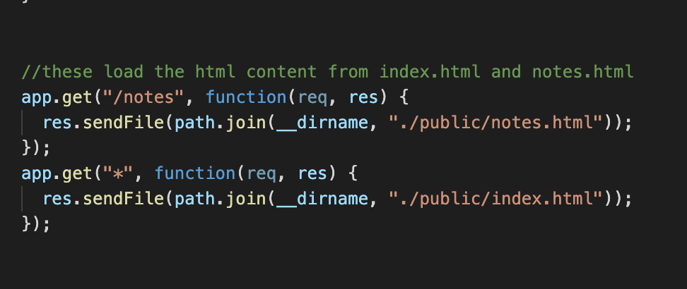
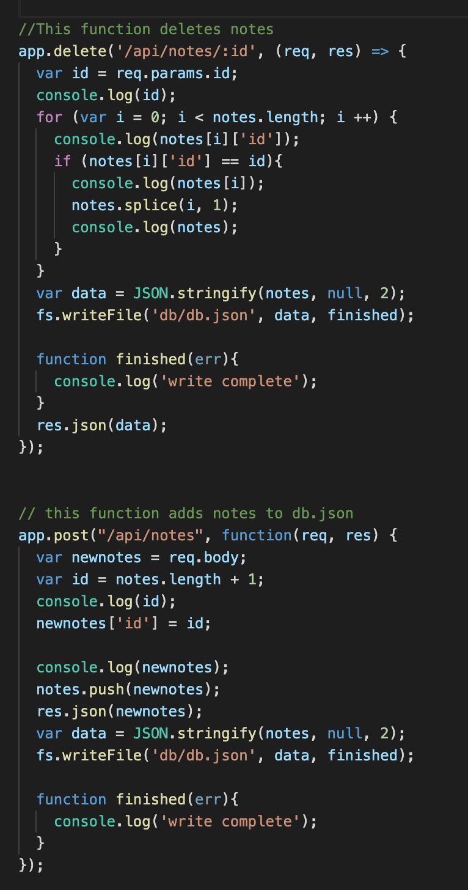

# template-engine-employee-summary

With this fancy app, the User may create, edit, store and delete multiple notes within a db.json file using express.js and server magic.
​
## Getting Started

Steps:
1) make your way to the GitHub repository (link provided at the bottom of this document) and clone yourself a copy somewhere on your computer.
(personally i prefer to make a folder on the desktop and place it there.)
To clone:
- simply select the link provided (clone) and coopy it.
- open terminal or git back (for you fancy windows peeps) and perform a git clone (link goes here) at the location of your choosing

2) open within VS Code or any code-viewing app you have/prefer
3) within the terminal, go ahead and perform an npm instiall to get all those pretty folders (node_modules)
- these are needed for the app to work.

4) in the terminal, typye node server.js to intiate the server (locally)
5) go to the localhost (typing localhost:3000 in your borwser) and expereince the magic of servers and my mad skill.

##  How i did this!

to start with, we (as in Students of Berkeley Extension Coding Bootcamp....that's a mouthfull) were given numerous files from which to sort through and use. The challenege here was to look at pre-designed code and add connections/functionality between the given files (index.js, notes.html, index.html, style.css and db.json) and the server (server.js) <-- this we would have to create on our own.

The first major challenge for me personally was actually unrelated to the project. Here is a very helpful tip and lesson for anyone who likes to work in a cafe...on a laptop. If you go to the counter, with laptop in bag and bag in hand....don't set said bag on the ground (slightly out of sight but still immediately next to your leg) even if for only a moment while you pay the coffee barista who conjures your happiness within a cup of dark joy. Because that bag....can get stolen and in the blink of an eye, usually by someone who has stolen before and he WILL outrun you. Safe to say, I had quite a handicap on my progress from the very beginning.

After a new laptop was aquired and the 5 stages of grief had passed, i found my next challenge in the examination of the pre-made code. This took a silly amount of time to figure out as i had to sort through every aspect of each file to better understand what i may need to change or alter when creating the server.js file. I eventually learned that, supposedly, these files were not in need of any alterations which definitely slowed my racing pulse...for a moment, at least.

Honestly the easiest part was the next step which was the inital creation of the server.js file. I coded the minimum needed amount to run the localhost server (mostly basing it off of previous class activities). This file would use express.js syntax for a majority of the content. at first, i simply ventured to load the html files with the css.

here are some images of the appearance.

initially the notes section would not display for the LONGEST time! took about a day and a half along with a great deal of emotional support from my husband and aid from some classmates and a TA before i was able to display anything from the db.json....that evil EVIL db.json. Anywho, once its contents began to appear, i started working on the ability to add and remove notes which took some time but mostly a lot of googling...and more emotional support (so basically like any other coding project).

After, i read in the homework asignemnt README.md that we needed to use Heroku to host our server stuff. By this time i was pretty tired so literally just looked up on youtube how to do it and from there, my app was born!

Here are some sections of code that gave me a bit of trouble.

Though some of this seems really simple and straight-forward to most, i persoanlly struggled a great deal with this project, for reasons im still not clear on. In my defense...this was all icnredibly new to me.

Just a closing note. Usually i add a gif demo to display the app's process but i am still very new to mac computers and not quite sure how to make videos of the screen display. I'll definitely add this in the future.

## Built With
​
* [HTML](https://developer.mozilla.org/en-US/docs/Web/HTML)
* [CSS](https://developer.mozilla.org/en-US/docs/Web/CSS)
* [Javascript](https://developer.mozilla.org/en-US/docs/Web/JavaScript)
* [Express.js](https://expressjs.com/)
​
​
## Authors
​
* **Casey Moldavon** 

For live Demo...
Live Heroku app: (https://note-taker-app12342.herokuapp.com/)
​
- [Link to Portfolio Site](https://casey-moldavon.github.io/updated-portfolio-page/)
- [Link to Github](https://github.com/casey-moldavon/note-taker)
- [Link to LinkedIn](https://www.linkedin.com/in/casey-moldavon-442a1761/)
​
See also the list of [contributors](https://github.com/your/project/contributors) who participated in this project.
​
## License
​
This project is licensed under the MIT License 
​
## Acknowledgments
​
* HUGE thanks to my amazing husband who put up with my stressed, crazed state throughout this assignment. Some big thanks also go to some of my classmates as well, to name a few: Christopher Melby, Andres Felipe Jimenez, Rachel Yeung, Tai Le and Oren Amema. They are all super amazing and were a huge help to me and each-other throughout. Would also like to thank the class TAs Mahisha Gunasekaran and Kerwin Hy.